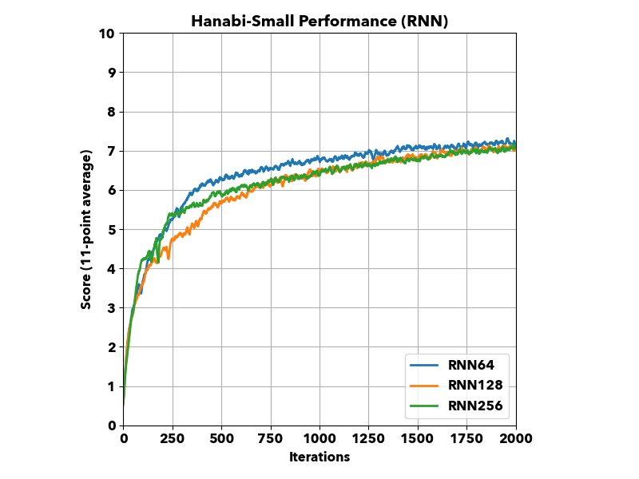
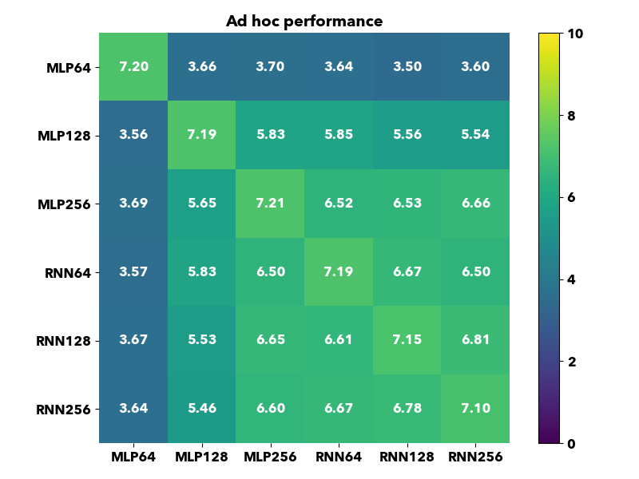

# Multi-Agent Cooperation in Hanabi with Policy Optimisation

This is the source code for my master's dissertation project **_Multi-Agent Cooperation in Hanabi with Policy Optimisation_**. As improvements have been made after the dissertation, please see [tag:final-report](https://github.com/patrick22414/hanabi_project/tree/final-report) for the version of used in my dissertation final report.

The implementation is based on [Proximal Policy Optimisation](https://arxiv.org/abs/1707.06347) and [Hanabi Learning Environment](https://github.com/deepmind/hanabi-learning-environment).

## Requirement

- Python 3.7+ (because I can't survive without f-strings)
- PyTorch (currently CPU only) (someone buy me a NVIDIA laptop plz?)
- [Hanabi Learning Environment](https://github.com/deepmind/hanabi-learning-environment)

## Performance

### Hanabi-Small

Hanabi-Small is a smaller version of Hanabi with a maximum score of 10. Currently we can train an agent on Hanabi-Small in under 8 hours on an 8-core CPU machine.

### Hanabi-Full

Hanabi-Full is the full version with a maximum score of 25. We are still tuning the hyperparameters for Hanabi-Full but this is our current results.

### Ad hoc teams

We can also do _ad hoc_ evaluation using trained agents.

